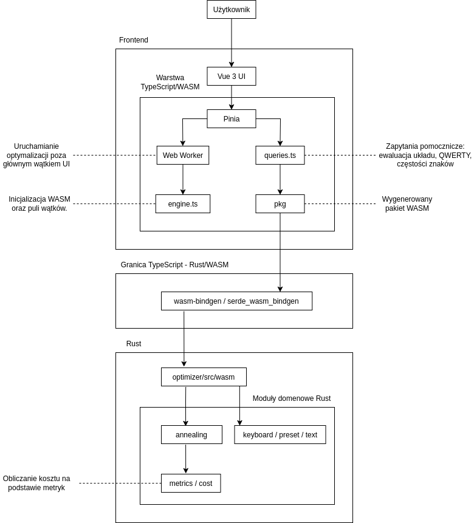

# Narzędzie do optymalizacji układu klawiatury - dokumentacja końcowa

## Zespół:
- Kamil Marszałek
- Michał Szwejk

## Live demo:
- [Aplikacja](https://keyboard-layout-optimizer.pages.dev/)

## Repozytoria:
- [GitHub](https://github.com/KamilMarszalek/keyboard-layout-optimizer)
- [GitLab PW](https://gitlab-stud.elka.pw.edu.pl/kmarsza1/keyboard-layout-optimizer)

## Opis działania
Aplikacja webowa do oceny i optymalizacji układu klawiatury dla podanego korpusu tekstu. Użytkownik może wpisać tekst oraz ustawić wagi metryk ergonomicznych. Całość może działać w dwóch trybach:
- `OPTIMIZE`: użytkownik może ustawić odpowiednio dla swoich celów parametry symulowanego wyżarzania, po kliknięciu przycisku "Optimize layout" zostaje uruchomiona optymalizacja, a po jej zakończeniu wyświetlany jest najlepszy znaleziony układ wraz z rozbiciem kosztu na metryki i wykresem historii kosztu.
- `EVALUATE`: użytkownik może ręcznie edytować układ klawiatury przez przeciąganie klawiszy, a następnie kliknąć "Evaluate layout" by zobaczyć jego koszt. Metryki, jak i sam koszt jest zestawiony ze standardowym układem QWERTY.

W obu trybach dostępna jest mapa ciepła prezentująca częstość użycia znaków w korpusie, a także wizualizacja układu klawiatury. Optymalizacja jest realizowana przez symulowane wyżarzanie. Optymalizacja uruchamiana jest z wielu punktów początkowych. Ciężkie obliczenia są wykonywane w Web Workerze. Moduł optymalizacyjny jest napisany w Rust i kompilowany do WebAssembly, a frontend jest zbudowany z Vue 3 i TypeScript.

## Realizacja wymagań początkowych

| Wymaganie z dokumentacji wstępnej | Status | Komentarz |
|---|---|---|
| Aplikacja z graficznym interfejsem, preferowana webowa | Zaimplementowano |  Interfejs jest aplikacją webową. |
| Optymalizacja układu za pomocą metaheurystyki | Zaimplementowano | Użyto symulowanego wyżarzania. |
| Moduł optymalizacyjny w języku niskopoziomowym | Zaimplementowano |  Logika kosztu, klawiatury, korpusu i SA jest w Rust, eksportowana do WASM. |
| Kompilacja Rust do WebAssembly przez `wasm-pack` | Zaimplementowano | Bindings są generowane do `frontend/src/pkg`. |
| Reprezentacja klawiatury i fizyczna geometria | Zaimplementowano wariant rozszerzony |  Model obejmuje 47 głównych klawiszy ANSI US - litery, cyfry i symbole oraz Shift jest obsługiwany. |
| Zmiana wyłącznie przypisań symboli do klawiszy, stała geometria | Zaimplementowano | Optymalizacja permutuje przypisania, nie geometrię. |
| Metryki: SFB, FD, HRU, HA, RJ | Zaimplementowano | Metryki zostały zaimplementowane wraz z odpowiednimi testami. |
| Parametryzacja wag przez użytkownika | Zaimplementowano | Walidacja jest po stronie TypeScript i Rust. |
| Sąsiedztwo SA jako zamiana dwóch losowych klawiszy | Zaimplementowano | Kandydat powstaje przez zamianę pary klawiszy. |
| Transliteracja tekstu wejściowego przez `any_ascii` | Zaimplementowano | Kod transliteruje do ASCII i usuwa znaki niegraficzne, zachowuje wielkość liter oraz obsługuje cyfry czy symbole. |
| Brak serwera pośredniczącego, komunikacja TypeScript-WASM | Zaimplementowano | Frontend importuje funkcje z pakietu WASM. |
| Wizualizacja układu klawiatury | Zaimplementowano |  Układ jest renderowany w stałych pozycjach ANSI. |
| Mapa ciepła użycia znaków | Zaimplementowano | Kolory są liczone z częstości znaków w korpusie. |
| Załadowanie własnego układu i statystyki | Zaimplementowano połowicznie | Układ klawiatury może zostać ustawiony wyłącznie przez ręczne przestawianie klawiszy (drag and drop). Nie istnieje żaden wygodniejszy format do importowania układu.  Z kolei ocenianie działa bezbłędnie - zdefiniowany układ można porównać z QWERTY. |
| Wykresy i statystyki wyników | Zaimplementowano | Dla historii kosztu renderowany jest wykres liniowy, a dla metryk - wykres słupkowy. |
| Web Workers dla zrównoleglenia/ciężkich obliczeń | Zaimplementowano | Optymalizacja działa w Workerze, a Rust używa Rayon i puli wątków WASM. |
| Zebranie komend do `just` | Zaimplementowano | Komendy są zorganizowane w pliku `Justfile`. |
| CI | Zaimplementowano poprzez GitHub Actions | Workflow CI uruchamia testy i sprawdzenia formatu, lintowania i typów. |

## Instrukcja użytkownika

Wymagania lokalne: Rust z targetem `wasm32-unknown-unknown`, Cargo, Node.js 22+, npm, `wasm-pack` oraz `just`. Zalecane jest użycie `docker` do uruchomienia aplikacji bez konieczności instalowania zależności lokalnie:

```bash
just docker-run # buduje i uruchamia aplikację na http://localhost:8080
```

Komendy używane podczas developmentu:

```bash
just setup              # instaluje target WASM i zależności frontendu
just wasm-pack          # generuje bindings WASM do frontend/src/pkg
just frontend-dev       # uruchamia Vite, zwykle http://localhost:5173
just frontend-build     # buduje frontend
just rust-build         # buduje crate Rust
just check              # pełne sprawdzenie: Rust, WASM, frontend
just test               # testy Rust i TypeScript
just docs               # dokumentacja Rust
just docker-check       # sprawdzenie projektu w Dockerze
```

## Architektura

Projekt jest aplikacją frontendową bez bazy danych i bez serwera backendowego. Rustowy moduł optymalizacyjny jest kompilowany do WebAssembly i ładowany przez frontend TypeScript. Dane przechodzą przez jawne DTO: po stronie Rust w `optimizer/src/wasm/dto.rs`, po stronie TypeScript w `frontend/src/wasm/dto.ts`.


Frontend odpowiada za interakcję z użytkownikiem, walidację formularzy, wizualizację układu klawiatury, mapę ciepła oraz prezentację wyników. Ciężkie obliczenia są delegowane do Web Workera, aby nie blokować głównego wątku interfejsu. Moduł Rust zawiera właściwą logikę domenową: reprezentację układu, geometrię klawiatury, przetwarzanie korpusu, metryki ergonomiczne oraz algorytm symulowanego wyżarzania. Granica między TypeScriptem a Rustem jest jawna i oparta na DTO serializowanych przez `serde_wasm_bindgen`.
Granica technologiczna jest w `frontend/src/wasm/queries.ts` i `optimizer/src/wasm/mod.rs`. Funkcje `optimize_layout`, `evaluate_layout`, `qwerty_layout` i `get_char_freq` przyjmują albo zwracają wartości serializowane przez `serde_wasm_bindgen`. Optymalizacja wymaga inicjalizacji puli wątków WASM (`initThreadPool`) i środowiska `crossOriginIsolated`, co jest sprawdzane w `frontend/src/wasm/engine.ts`. Do tego wymagana jest konfiguracja serwera z odpowiednimi nagłówkami COOP/COEP, co jest realizowane w `Dockerfile.app`.


## Szczegóły implementacyjne

Najważniejsze moduły Rust:

- `keyboard`: typy domenowe wraz z odpowiednimi operacjami: `Layout` - reprezentacja układu klawiatury, `Geometry` - geometria klawiatury, `Modifier` - zamiana symboli shifted na bazowe oraz odwrotnie.
- `preset`: gotowe presety QWERTY US i Dvorak US oraz standardowa geometria ANSI.
- `text`: transliteracja przez `any_ascii`, mapowanie tekstu na naciśnięcia i budowa struktury `Corpus`, która jest używana do obliczania metryk.
- `annealing`: symulowane wyżarzanie, funkcja kosztu i wybór najlepszego wyniku spośród wielu uruchomień.
- `wasm`: interfejs WebAssembly, DTO i walidacja danych przychodzących z frontendu.

Najważniejsze moduły frontendu:

- `features/config`: formularze umożliwiające ustawienie wag, parametrów SA i ziarna losowości.
- `features/corpus`: tekst wejściowy.
- `features/keyboard`: renderowanie układu, mapa ciepła, edycja przez drag-and-drop.
- `features/optimizer`: uruchamianie optymalizacji w Workerze.
- `features/evaluator`: ocena ręcznie edytowanego układu oraz porównanie z QWERTY.
- `features/results`: wykres historii kosztu, wykresy metryk.

Kluczowe decyzje techniczne:
- koszt jest rozbity na metryki i dopiero potem ważony. 
- `Corpus` przechowuje tablicę unigramów i macierz bigramów dla obsługiwanych naciśnięć, co umożliwia szybkie i łatwe obliczanie metryk.
- optymalizacja uruchamiana jest równolegle z kilku punktów początkowych: układu QWERTY, układu Dvoraka oraz losowych układów
- ciężka optymalizacja jest odseparowana od głównego wątku UI przez Web Worker, dzięki czemu strona reaguje na interakcje użytkownika.

## Testy i analiza statyczna

W Rust zostało napisanych 156 testów jednostkowych, które pokrywają reprezentację klawiatury, geometrię, korpus, metryki, symulowane wyżarzanie i walidację DTO WASM. Testy są inline w modułach, a `Justfile` zawiera komendy do uruchomienia wszystkich testów. Do przygotowania testów parametrycznych użyto crate'a `rstest`. Umożliwia on definiowanie testów z różnymi zestawami danych wejściowych poprzez makra, co jest szczególnie przydatne do testowania metryk i algorytmu optymalizacji na różnych układach i korpusach.

W frontendzie znajduje się kilka testów jednostkowych, które sprawdzają logikę funkcji pomocniczych.

Używamy `clippy` do analizy statycznej Rust, a `eslint` i `tsc` do TypeScript. Komendy do uruchomienia tych narzędzi są zorganizowane w `Justfile`.

## Dokumentacja wygenerowana z kodu

Dokumentacja kodu Rust może zostać wygenerowana poleceniem:

```bash
just docs
```
Komenda generuje dokumentację na podstawie komentarzy dokumentacyjnych Rust. W typowej konfiguracji `cargo doc` wynik znajduje się w katalogu target/doc. Projekt nie ma osobno skonfigurowanej dokumentacji TypeScript, dlatego dokumentacja wygenerowana automatycznie dotyczy przede wszystkim części Rust.

## Metryki projektu
| Metryka | Wartość |
|---|---:|
| Liczba linii kodu Rust | 3453 |
| Liczba linii kodu TypeScript/Vue | 3012 |
| Liczba testów Rust | 156 |
| Pokrycie testami | 90% |


## Różnice względem planu początkowego

Największa zmiana zakresu to rozszerzenie reprezentacji z 26 liter do 47 klawiszy ANSI US wraz z symbolami shifted. Dzięki temu aplikacja obsługuje cyfry i interpunkcję, które w planie były tylko możliwym rozszerzeniem.

Transliteracja została zrealizowana przez `any_ascii`, ale normalizacja nie ogranicza tekstu do małych liter `a-z`. Zachowuje graficzne znaki ASCII.

Zrównoleglenie zostało zrealizowane szerzej niż w prostym wariancie: frontend uruchamia optymalizację w Web Workerze, a Rust używa Rayon przez `wasm-bindgen-rayon` do multi-start SA.

## Problemy i wnioski

Widocznym ograniczeniem jest wymóg `crossOriginIsolated` dla wątków WASM. Aplikacja musi być serwowana z odpowiednimi nagłówkami COOP/COEP, inaczej inicjalizacja puli wątków zakończy się błędem.

Granica TypeScript-WASM wymaga utrzymania zgodności DTO i walidacji po obu stronach. To poprawia odporność na błędne dane, ale zwiększa koszt zmian pól formularza i wyników.

Generowany katalog `frontend/src/pkg` jest warunkiem działania frontendu, dlatego lokalne uruchomienie wymaga wcześniejszego `just wasm-pack`. CI i Docker robią to jawnie.

Pokrycie testami jest mocne po stronie Rust, ale frontend ma tylko jeden plik testowy.

Użycie `wasm-bindgen-rayon` pozwoliło zrównoleglić obliczenia w module WASM, ale wymagało specyficznej konfiguracji kompilacji, w tym obsługi atomics oraz toolchainu `nightly`. Skutkuje to ostrzeżeniem kompilatora o niestabilnej fladze `-Ctarget-feature=atomics`. Ostrzeżenie nie uniemożliwia działania aplikacji, ale pokazuje, że wielowątkowość WASM w tej konfiguracji wiąże się z dodatkową złożonością środowiska budowania.

## Pomysły na rozszerzenia
Obecnie w trybie `EVALUATE` layout użytkownika jest porównywany tylko z QWERTY. Można dodać możliwość porównania z Dvorakiem lub innymi presetami. Można też umożliwić użytkownikowi zapisanie układu i jego statystyk. Dodatkowo, można dodać możliwość eksportu przeprowadzonych ewaluacji do pliku CSV, co pozwoliłoby użytkownikom na dalszą analizę danych w zewnętrznych narzędziach. Moglibyśmy też zbierać wyniki optymalizacji i ewaluacji od użytkowników i prezentować na stronie zestawienia najlepszych układów dla różnych korpusów, co stworzyłoby społecznościowy aspekt aplikacji.
